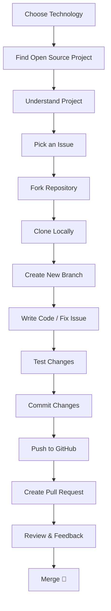

<<<<<<< HEAD
# 🚀 Open Source Contribution – Complete Step-by-Step Plan
=======
🚀 Open Source Contribution – Complete Step-by-Step Plan

>>>>>>> 2cbe201a804704a756aa8fbf09fb3386e9ae7228


This document explains **how to start and grow in open source contributions**, written in a **clear, structured, and GitHub-friendly way**. You can directly publish this as a `README.md` or blog post in your GitHub repository.

---

## 📌 What is Open Source Contribution?

Open source contribution means **collaborating on publicly available projects** by fixing bugs, adding features, improving documentation, writing tests, or reviewing code.

Anyone can contribute — students, freshers, professionals — and it is one of the **best ways to gain real-world experience**.

---

## 🎯 Why Contribute to Open Source?

* ✅ Real-world coding experience
* ✅ Improves Git & GitHub skills
* ✅ Builds strong developer portfolio
* ✅ Learn from senior developers
* ✅ Increases job & internship chances
* ✅ Improves communication & teamwork

---

## 🧭 Overall Contribution Flow (High-Level Diagram)



---

## 🧱 Step-by-Step Detailed Plan

---

### 🧩 Step 1: Choose Your Technology

Start with what you already know:

* Java / Spring Boot
* JavaScript / React
* Python
* HTML / CSS
* Documentation (Markdown)

> 💡 Tip: Even **documentation fixes** count as valid contributions.

---

### 🔍 Step 2: Find Open Source Projects

Ways to find projects:

* GitHub Explore: [https://github.com/explore](https://github.com/explore)
* Search by topics:

  * `java`
  * `spring-boot`
  * `react`
* Beginner-friendly labels:

  * `good first issue`
  * `beginner`
  * `help wanted`

---

### 📖 Step 3: Understand the Project

Before coding:

* Read `README.md`
* Check project structure
* Understand:

  * What the project does
  * How to run it locally
  * Contribution guidelines (`CONTRIBUTING.md`)

> ❌ Never directly start coding without understanding the project.

---

### 🐞 Step 4: Pick an Issue

Go to **Issues tab** and select:

* Easy or beginner-friendly issues
* Clear problem statement
* Already discussed issues are better

Comment on the issue:

> "Hi, I would like to work on this issue. Please assign it to me."

---

### 🍴 Step 5: Fork the Repository

Fork creates **your own copy** of the project.

* Click **Fork** button on GitHub
* Repository is copied to your account

---

### 💻 Step 6: Clone Repository Locally

```bash
git clone https://github.com/your-username/project-name.git
cd project-name
```

---

### 🌿 Step 7: Create a New Branch

Never work on `main` branch.

```bash
git checkout -b fix-login-bug
```

Branch name should be meaningful.

---

### 🛠️ Step 8: Write Code / Fix Issue

* Follow project coding standards
* Keep changes small & clean
* Add comments if needed
* Update documentation if required

---

### 🧪 Step 9: Test Your Changes

* Run the project locally
* Make sure nothing breaks
* Fix errors & warnings

> ✅ Code should work before pushing.

---

### 📝 Step 10: Commit Changes

```bash
git add .
git commit -m "Fix login validation issue"
```

Commit message rules:

* Clear
* Short
* Meaningful

---

### ⬆️ Step 11: Push to GitHub

```bash
git push origin fix-login-bug
```

---

### 🔁 Step 12: Create Pull Request (PR)

* Go to your forked repo
* Click **Compare & Pull Request**
* Describe:

  * What you changed
  * Why you changed it

Example PR description:

> Fixed login validation bug by adding null checks and error messages.

---

### 👀 Step 13: Review & Feedback

Maintainers may:

* Ask for changes
* Suggest improvements
* Approve directly

Respond politely and update code if needed.

---

### 🎉 Step 14: PR Merged – You Are a Contributor!

Once merged:

* Your name appears in contributors list
* You officially contributed to open source 🎊

---

## 📂 Recommended Repository Structure for This Plan

```
open-source-guide/
│── README.md
│── diagrams/
│   └── contribution-flow.png
│── examples/
│   └── sample-pr.md
```

---

## 📈 How to Grow After First Contribution

* Contribute regularly
* Pick slightly harder issues
* Review others' PRs
* Write tests
* Become project maintainer (long-term)

---

## 🧠 Final Advice

> "Start small, stay consistent, and learn publicly. Open source rewards patience and curiosity."

---

⭐ If you found this helpful, don’t forget to **star** the repository and share it with others!
