🚀 Open Source Contribution – Complete Step-by-Step Plan


This document explains how to start and grow in open source contributions, written in a clear, structured, and GitHub-friendly way. You can directly publish this as a README.md or blog post in your GitHub repository.


# 🚀 Open Source Contribution Guide


A **complete, beginner‑friendly roadmap** to start contributing to open source projects using GitHub. This repository is designed for **students, freshers, and early‑career developers** who want real‑world experience.

---

## 📑 Table of Contents

* [What is Open Source Contribution?](#-what-is-open-source-contribution)
* [Why Contribute to Open Source?](#-why-contribute-to-open-source)
* [Overall Contribution Flow](#-overall-contribution-flow)
* [Step-by-Step Contribution Plan](#-step-by-step-contribution-plan)
* [Recommended Repository Structure](#-recommended-repository-structure)
* [How to Grow After First Contribution](#-how-to-grow-after-first-contribution)
* [Final Advice](#-final-advice)

---

## 📌 What is Open Source Contribution?

Open source contribution means **collaborating on publicly available projects** by:

* Fixing bugs
* Adding new features
* Improving documentation
* Writing tests
* Reviewing code

Anyone can contribute — **students, freshers, professionals** — and it is one of the **best ways to gain real‑world development experience**.

---

## 🎯 Why Contribute to Open Source?

* ✅ Real‑world coding experience
* ✅ Strong Git & GitHub practice
* ✅ Impressive developer portfolio
* ✅ Learn industry‑level coding standards
* ✅ Higher chances of jobs & internships
* ✅ Better communication & collaboration skills

---

## 🧭 Overall Contribution Flow

```mermaid
flowchart TD
    A[Choose Technology] --> B[Find Open Source Project]
    B --> C[Understand Project]
    C --> D[Pick an Issue]
    D --> E[Fork Repository]
    E --> F[Clone Locally]
    F --> G[Create New Branch]
    G --> H[Write Code / Fix Issue]
    H --> I[Test Changes]
    I --> J[Commit Changes]
    J --> K[Push to GitHub]
    K --> L[Create Pull Request]
    L --> M[Review & Feedback]
    M --> N[Merge 🎉]
```



---

## 🧱 Step-by-Step Contribution Plan

### 🧩 Step 1: Choose Your Technology

Start with what you already know:

* Java / Spring Boot
* JavaScript / React
* Python
* HTML / CSS
* Documentation (Markdown)

> 💡 Even documentation contributions are **valid and valuable**.

---

### 🔍 Step 2: Find Open Source Projects

You can discover projects using:

* GitHub Explore → [https://github.com/explore](https://github.com/explore)
* GitHub topic search (`java`, `spring-boot`, `react`)
* Beginner labels:

  * `good first issue`
  * `beginner`
  * `help wanted`

---

### 📖 Step 3: Understand the Project

Before coding:

* Read `README.md`
* Check folder structure
* Review `CONTRIBUTING.md`
* Learn how to run the project locally

> ❌ Never start coding without understanding the project.

---

### 🐞 Step 4: Pick an Issue

* Open the **Issues** tab
* Choose beginner‑friendly issues
* Prefer issues with clear description

Comment on the issue:

> Hi, I would like to work on this issue. Please assign it to me.

---

### 🍴 Step 5: Fork the Repository

* Click **Fork** on GitHub
* A copy of the repository is created under your account

---

### 💻 Step 6: Clone Repository Locally

```bash
git clone https://github.com/your-username/project-name.git
cd project-name
```

---

### 🌿 Step 7: Create a New Branch

```bash
git checkout -b fix-login-bug
```

> Always work on a **feature branch**, never on `main`.

---

### 🛠️ Step 8: Write Code / Fix Issue

* Follow coding standards
* Keep changes small and clean
* Add comments where needed
* Update documentation if required

---

### 🧪 Step 9: Test Your Changes

* Run the project locally
* Fix errors and warnings
* Ensure nothing breaks

---

### 📝 Step 10: Commit Changes

```bash
git add .
git commit -m "Fix login validation issue"
```

Commit message should be **clear and meaningful**.

---

### ⬆️ Step 11: Push to GitHub

```bash
git push origin fix-login-bug
```

---

### 🔁 Step 12: Create Pull Request (PR)

* Click **Compare & Pull Request**
* Clearly explain:

  * What you changed
  * Why you changed it

Example:

> Fixed login validation bug by adding null checks and error handling.

---

### 👀 Step 13: Review & Feedback

Maintainers may:

* Request changes
* Suggest improvements
* Approve the PR

Respond politely and update your code if required.

---

### 🎉 Step 14: PR Merged – You Are a Contributor!

* Your code becomes part of the project
* Your name appears in contributors list
* Congratulations 🎊

---

## 📂 Recommended Repository Structure

```
open-source-guide/
│── README.md
│── diagrams/
│   └── contribution-flow.png
│── examples/
│   └── sample-pr.md
```

---

## 📈 How to Grow After First Contribution

* Contribute consistently
* Pick slightly complex issues
* Review other contributors’ PRs
* Add unit tests
* Aim to become a maintainer

---

## 🧠 Final Advice

> Start small, stay consistent, and learn in public. Open source rewards curiosity and patience.

---

⭐ If this guide helped you, please **star the repository** and share it with the community!
